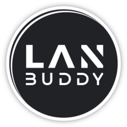

<p align="center">

</p>

# Website

The lanbuddy project website is hosted at https://lanbuddy.org

It is written in [Vue 3](https://vuejs.org) with the help of the amazing [Quasar](https://quasar.dev) framework.

## Setup the development environment

Clone the code and run one of the following commands:

```bash
yarn
# or
npm install
```

After this is finished you can start the development server with:

```bash
quasar dev
# or
yarn quasar dev
```

The quasar development server is based on vite and supports hot reload. (Browser View updates itself whenever you change something in the code.)
